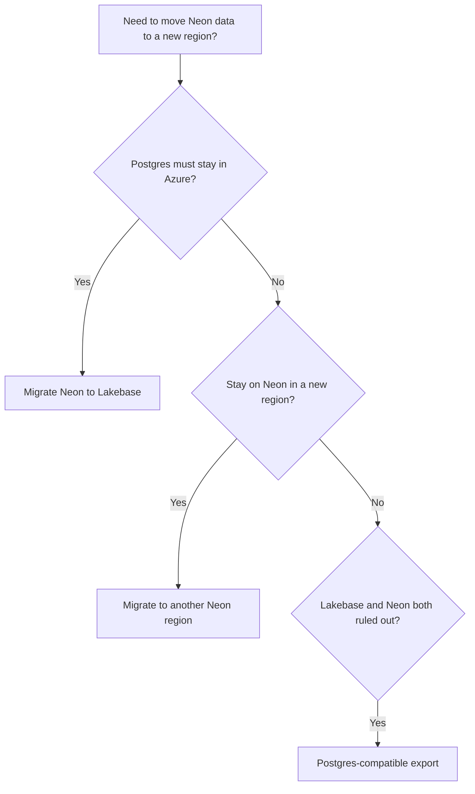

A Neon **project** is created in a single [region](/docs/introduction/regions). Your database runs there, and you **cannot change the region** for that project.

If you need your **data** in a different region, you **create a new Neon project** in that region and **migrate your database** into it.

Common reasons to migrate to a different region:

- Your app moved to a different region and you want lower latency.
- You need a new environment in another region.
- You are migrating away from a [deprecated Neon Azure](/docs/introduction/regions#azure-regions) region.

<Admonition type="note" title="Databricks Lakebase">
If you must keep Postgres in Azure for residency or colocation, consider **[Lakebase Postgres](https://docs.databricks.com/aws/en/oltp)** on Databricks. It supports Azure regions and most Neon features.
</Admonition>

## Choose a path

Use the flowchart to pick a migration guide.

## Where to go next

1. **[Migrate to another Neon region](/docs/guides/migrate-neon-to-another-region)**. Compare the Import Data Assistant, dump and restore, and logical replication, then follow the method-specific how-to linked from that page. For Neon-to-Neon **`pg_dump` / `pg_restore`**, you can **pipe** `pg_dump` to `pg_restore` for smaller databases ([Migrate data from another Neon project](/docs/import/migrate-from-neon)) or run **separate** dump and restore commands ([Migrate data from Postgres](/docs/import/migrate-from-postgres)).
2. **[Migrate Neon to Lakebase](/docs/guides/migrate-neon-to-lakebase)**. Create a Lakebase project, **`pg_dump`** from Neon, **`pg_restore`** on Lakebase.
3. **[Postgres-compatible export from Neon](/docs/guides/export-neon-postgres-compatible)**. When another Neon region and Lakebase do not meet your requirements. Use `pg_dump` to export your data in a Postgres-compatible for migration elsewhere.

## Cutover for live databases

When you migrate a **production** database, plan verification and cutover together with the method you chose (Import Data Assistant, dump and restore, or logical replication). Use the how-to for that method for the exact sequence; this checklist is the common thread.

- **Verify** data and application behavior against the **target** project before you switch traffic.
- **Pause or stop writes** to the source when your migration method requires it (for example before a final **`pg_dump`** / **`pg_restore`** pass, or before the last logical replication sync).
- **Cut over** by updating connection strings, secrets, and environment variables so applications use the **target** Neon project in the new region.
- **Monitor** the target after cutover until you are confident, then **retire** or delete the source project when you no longer need it.

Until you cut over, treat the **source** as the system of record.

## AI assistance

If you want **AI help in your editor** while you migrate (for example **creating a Neon project** in your **target region**, drafting **`pg_dump`** and **`pg_restore`** commands, or working through **logical replication**), run **[`npx neonctl@latest init`](/docs/reference/cli-init)**. It sets up the Neon CLI, **Neon MCP Server**, and the **[Neon agent skills](https://github.com/neondatabase/agent-skills)** repo for supported editors.

<NeedHelp/>
