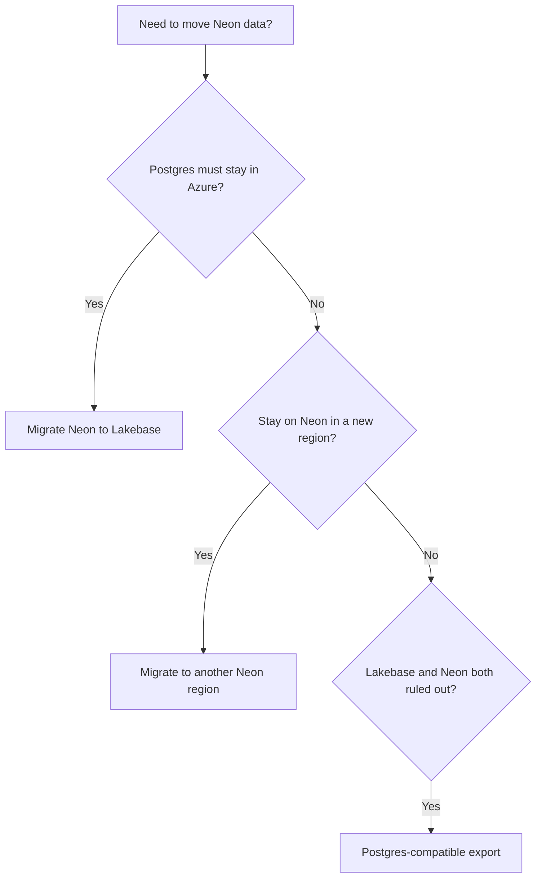

A Neon **project** is created in a single [region](/docs/introduction/regions). Your database runs there, and you **cannot change the region** for that project.

If you need your **data** in a different region, you **create a new Neon project** in that region and **migrate your database** into it.

Common reasons to migrate data:

- Your app moved to a different region and you want lower latency.
- You need a new environment in another region.
- You are migrating away from a deprecated Neon Azure region.

<Admonition type="note" title="Databricks Lakebase">
If you must keep Postgres in Azure for residency or colocation, consider **[Lakebase Postgres](https://docs.databricks.com/aws/en/oltp)** on Databricks. It supports Azure regions and most Neon features.
</Admonition>

## Choose a path

Use the flowchart or table to pick a migration guide.

| Question                                                     | If yes                                                            | If no                                                                                                                                                                                                                                 |
| ------------------------------------------------------------ | ----------------------------------------------------------------- | ------------------------------------------------------------------------------------------------------------------------------------------------------------------------------------------------------------------------------------- |
| Must Postgres stay in **Azure**?                             | [Migrate Neon to Lakebase](/docs/guides/migrate-neon-to-lakebase) | Stay on Neon in **AWS** ([Azure to AWS pairings](/docs/guides/migrate-neon-to-another-region#choosing-a-destination-aws-region-from-neon-on-azure)) via [Migrate to another Neon region](/docs/guides/migrate-neon-to-another-region) |
| Under **~10 GB** and you want the **Import Data Assistant**? | Start with the Neon region guide (Assistant section)              | Use **pg_dump** / **pg_restore** or **logical replication** in the same guide                                                                                                                                                         |
| Need **near-zero downtime**?                                 | Prefer **logical replication** in the Neon region guide           | Plan a maintenance window for dump and restore                                                                                                                                                                                        |

<Admonition type="note" title="Logical replication is Neon-to-Neon only">
Logical replication is **not** supported for **Neon to Lakebase** migrations. For Lakebase, use **`pg_dump`** and **`pg_restore`** ([Migrate Neon to Lakebase](/docs/guides/migrate-neon-to-lakebase)).
</Admonition>

## Where to go next

1. **[Migrate to another Neon region](/docs/guides/migrate-neon-to-another-region)**. New Neon project in the target region, then Import Data Assistant, dump and restore, or logical replication to move your database.
2. **[Migrate Neon to Lakebase](/docs/guides/migrate-neon-to-lakebase)**. End-to-end guide: Lakebase setup, **`pg_dump`** from Neon, **`pg_restore`** on Lakebase, verify, and cut over.
3. **[Postgres-compatible export from Neon](/docs/guides/export-neon-postgres-compatible)**. When another Neon region and Lakebase do not fit. Standard `pg_dump` output.

## AI assistance

If you want **AI help in your editor** while you migrate (for example **creating a Neon project** in your **target region**, drafting **`pg_dump`** and **`pg_restore`** commands, or working through **logical replication**), run **[`neon init`](/docs/reference/cli-init)**. It sets up the Neon CLI, **Neon MCP Server**, and the **[Neon agent skills](https://github.com/neondatabase/agent-skills)** repo for supported editors.

<NeedHelp/>
