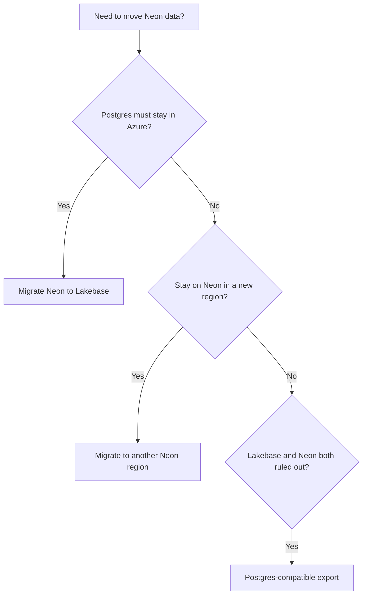

A Neon **project** is created in a single [region](/docs/introduction/regions). Your database runs there, and you **cannot change the region** for that project.

If you need your **data** in a different region, you **create a new Neon project** in that region and **migrate your database** into it.

Common reasons to migrate data:

- Your app moved to a different regions and you want lower latency.
- You need a new environment in another region.
- You are migrating away from a deprecated Azure region.

If you must keep Postgres **in Azure** for residency or colocation, compare **Neon on AWS** (same Neon product in a nearby AWS region, via a **new** Neon project) with **Databricks Lakebase** (Postgres in Azure). The table below suggests AWS regions when you migrate **from Neon on Azure** and want to stay on Neon.

## Choose a path

Use the flowchart or table to pick a guide. Details for each method live in the linked guides and in [Neon data migration guides](/docs/import/migrate-intro).

| Question                                                     | If yes                                                            | If no                                                                                                                         |
| ------------------------------------------------------------ | ----------------------------------------------------------------- | ----------------------------------------------------------------------------------------------------------------------------- |
| Must Postgres stay in **Azure**?                             | [Migrate Neon to Lakebase](/docs/guides/migrate-neon-to-lakebase) | Stay on Neon in **AWS** (see mapping table) via [Migrate to another Neon region](/docs/guides/migrate-neon-to-another-region) |
| Under **~10 GB** and you want the **Import Data Assistant**? | Start with the Neon region guide (Assistant section)              | Use **pg_dump** / **pg_restore** or **logical replication** in the same guide                                                 |
| Need **near-zero downtime**?                                 | Prefer **logical replication** in the Neon region guide           | Plan a maintenance window for dump and restore                                                                                |

The [Import Data Assistant](/docs/import/import-data-assistant) works well for smaller databases (roughly **under 10 GB**). Larger databases usually use **pg_dump** and **pg_restore** or **logical replication**. See [Migrate data from Postgres](/docs/import/migrate-from-postgres) and [Replicate data from one Neon project to another](/docs/guides/logical-replication-neon-to-neon) for mechanics.

<Admonition type="warning" title="Azure regions on Neon">
Neon is deprecating **Azure** regions for Neon projects (`azure-eastus2`, `azure-westus3`, `azure-gwc`). If your database runs there, plan a **data migration**. **Suggested paths:** (1) **another Neon project** on **AWS** when you can use AWS (use the mapping table below), (2) **Databricks Lakebase** when you need Postgres to stay in **Azure**, (3) **Postgres-compatible export** when neither option works.

**Starting April 2, 2026:** You can no longer **create new Neon projects** in **Azure** regions. **Migration deadlines** for existing projects are communicated by **email from Neon** and in the **[Neon changelog](/docs/changelog)**.
</Admonition>

## Azure Neon regions to suggested Neon AWS regions

These pairings are **guidance** only. Measure latency from your app and talk to [Support](/docs/introduction/support) if you are unsure.

| Neon Azure region                                   | Suggested Neon AWS region      |
| --------------------------------------------------- | ------------------------------ |
| `azure-eastus2` (Azure East US 2, Virginia)         | `aws-us-east-1` (N. Virginia)  |
| `azure-westus3` (Azure West US 3, Arizona)          | `aws-us-west-2` (Oregon)       |
| `azure-gwc` (Azure Germany West Central, Frankfurt) | `aws-eu-central-1` (Frankfurt) |

## Where to go next

1. **[Migrate to another Neon region](/docs/guides/migrate-neon-to-another-region)**. New Neon project in the target region (often AWS), then Import Data Assistant, dump and restore, or logical replication to move your database.
2. **[Migrate Neon to Lakebase](/docs/guides/migrate-neon-to-lakebase)**. Stay in Azure with Databricks Lakebase Postgres. You dump from Neon and restore into Lakebase. Follow Databricks docs for the Lakebase side.
3. **[Postgres-compatible export from Neon](/docs/guides/export-neon-postgres-compatible)**. When another Neon region and Lakebase do not fit. Standard `pg_dump` output.

## Cutover for live databases

Production moves need a clear **cutover** order:

1. **Slow or stop writes** on the source (Neon cannot freeze writes for you). See [Move your database to another region](/docs/introduction/regions#move-your-database-to-another-region).
2. **Finish replication** or **final restore**, then **verify** the target.
3. **Rotate connection strings and secrets** (app env vars, CI, pools, schedulers). See [Switch over your applications](/docs/postgresql/postgres-upgrade#switch-over-your-applications).
4. **Monitor** the new database, then **retire** the Neon source project when you no longer need rollback.

For logical replication, confirm **lag** and **consistency** using [Replicate data from one Neon project to another](/docs/guides/logical-replication-neon-to-neon) and [Get started with logical replication](/docs/guides/logical-replication-guide) before you send traffic to the subscriber.

Run long `pg_dump` / `pg_restore` jobs from a **stable** machine (CI runner or VM) with a reliable network. Use **unpooled** connection strings. See [Migrate data from Postgres](/docs/import/migrate-from-postgres).

If you have **many** Neon **projects**, repeat the process per project. If you have **many Postgres databases** inside a single Neon project, repeat the process **per database**, and consider **scripting** a **`pg_dump`** and **`pg_restore`** process.

## AI assistance in your editor

If you want **AI help in your editor** while you migrate (for example **creating a Neon project** in your **target region**, drafting **`pg_dump`** and **`pg_restore`** commands, or working through **logical replication**), run **[`neon init`](/docs/reference/cli-init)**. It sets up the Neon CLI, **Neon MCP Server**, and the **[Neon agent skills](https://github.com/neondatabase/agent-skills)** repo for supported editors. The **neon-postgres** skill can use Neon docs to help with projects, branches, and connection details. You still run **`pg_dump`**, replication SQL, and **application cutover** yourself.

<NeedHelp/>
